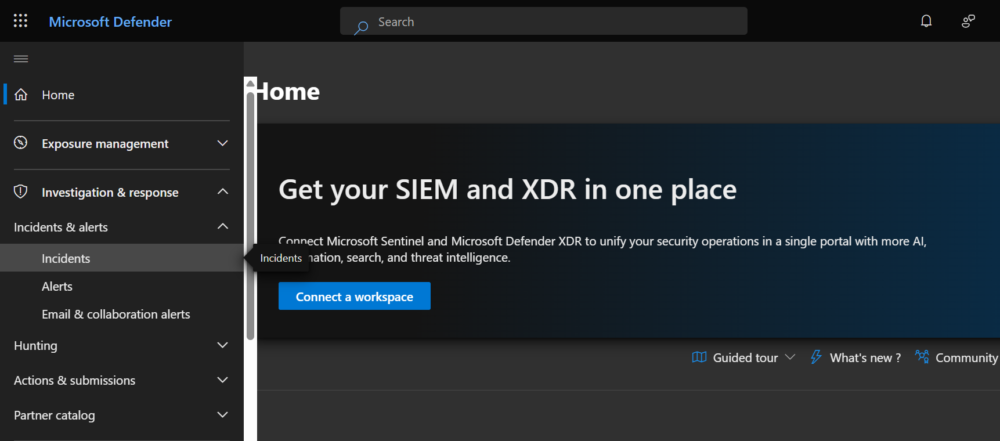
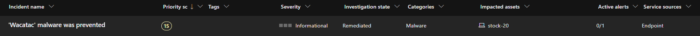
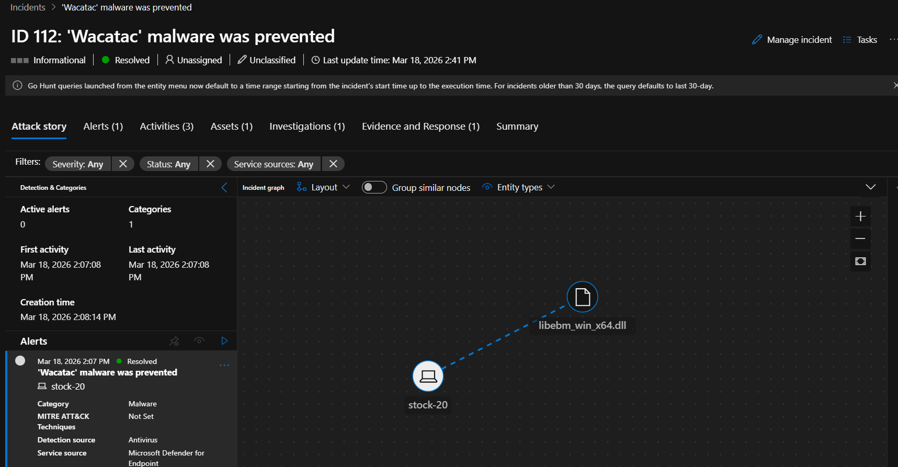
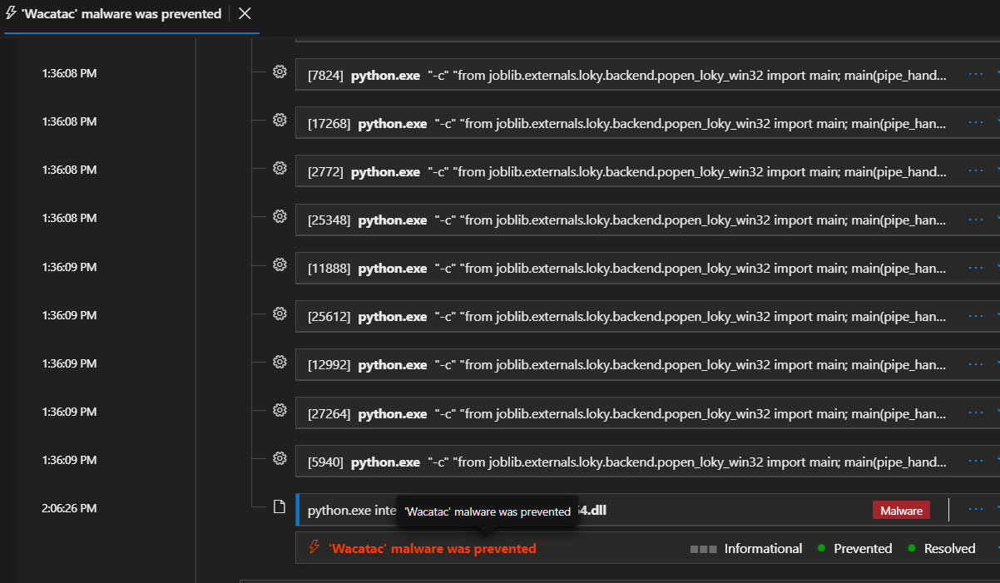
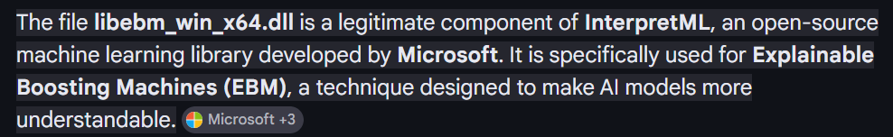
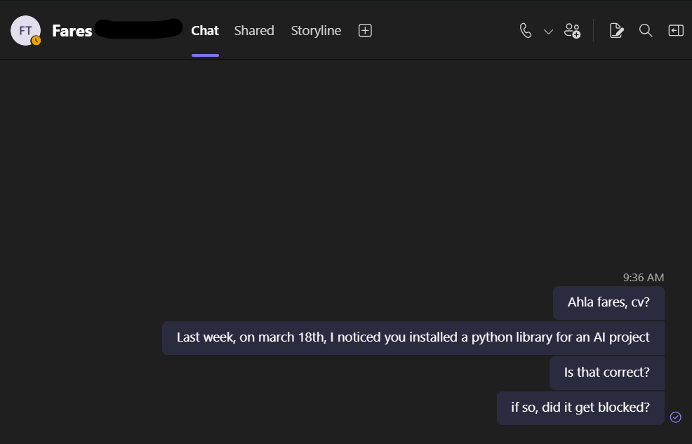
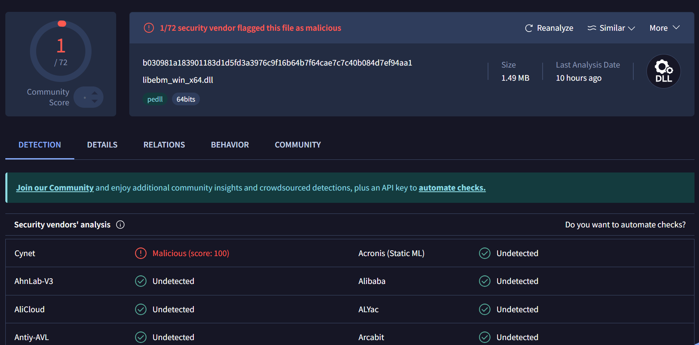
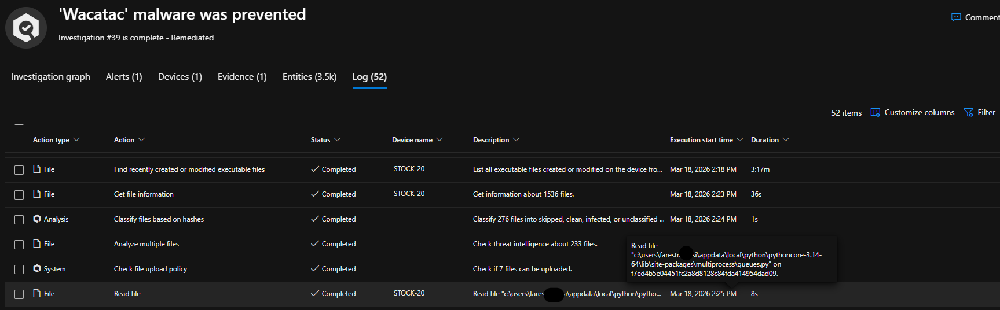
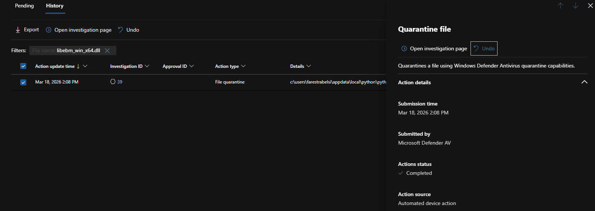

# Incident Report: 'Wacatac' malware was prevented

*Proof AI won't take over SOC analyst jobs, anytime soon (but it will definetyl will in the future ;( )*

## 1. Incident Overview

- Incident title: 'Wacatac' malware was prevented
- Platform: Microsoft Defender XDR
- Severity: High
- Category: Malware
- Status at review: Resolved / Remediated
- Affected device: stock-20
- Detection source: Microsoft Defender for Endpoint (Antivirus)
- Suspicious file: libebm_win_x64.dll

This incident was triggered when Microsoft Defender detected activity related to libebm_win_x64.dll and classified it as a Wacatac-related malware alert. The automated investigation completed and applied quarantine action successfully.

## 2. Analysis steps

### 01 - Defender Portal Navigation
I got an email alert from Microsoft Defender, so I navigated to the security.microsoft.com admin portal > Investigation & response > Incidents, to investigate the alert.

### 02 - Incident Listed
I quickly found the incident entry: " 'Wacatac' malware was prevented, with informational severity and remediated state".

This means Microsoft's AIR **Automated Investigation and Remediation** has detected and remediated a potential threat automatically.
As a SOC analyst, I shouldn't always trust AI, no matter how advanced it may be.

### 03 - Incident Details
Confirms:
- Incident ID 112
- Resolved state
- Last update: Mar 18, 2026
- Device/entity relation between stock-20 and libebm_win_x64.dll

=> Not a very complex incident, but requires looking into never the less.

### 04 - Alert Activity/Process Context
Now let's follow the whole story of the incident, and how, when and what the AIR has found:

From the incident story, we can trace the process tree over time.
The timeline shows multiple python.exe executions and interactions with several files. Reviewing the command lines indicates these were automated script/tool-driven actions rather than manual user activity, which is normal in Python workflows. Combined with the file paths, file context, and the user's role and department, this context was crucial in determining whether the activity represented a real threat.

### 05 - Legitimacy Check (Contextual Validation)
In fact, I know the user *Fares* is working on an AI project, so this is better than finding this alert on the device of an hr or a finance manager for example.

A simple search confirmed that libebm_win_x64.dll can be a legitimate component of InterpretML (Microsoft open-source ML library), supporting possible false-positive assessment.

### 06 - User Verification
But this still doesn't eliminate the threat.
There is always a possibility of them or an external party downloading a library from untrusted sources and it turns out to be malicious.

So I had to make sure with the user himself to verify whether a Python library installation occurred around March 18 and whether blocking happened, which they then confirmed.

### 07 - Threat Intelligence Cross-check
VirusTotal-style result shows 1/72 engines flagged the file, while the majority reported undetected, further supporting low-confidence malicious classification.

### 08 - Automated Investigation Log
Shows investigation completion and analysis actions performed by the AIR across files and hashes.

### 09 - Containment Action Evidence
Shows file quarantine action for libebm_win_x64.dll:
- Action type: File quarantine
- Source: Automated device action / Microsoft Defender AV
- Status: Completed
- Submission time: Mar 18, 2026 2:08 PM

## 3. Investigation and Response Actions Taken

1. Accessed Microsoft Defender incident queue and identified the triggered malware incident.
2. Opened incident details and reviewed device/file relationship, alert metadata, and timeline.
3. Examined process context, noting python.exe activity linked to Python package execution paths.
4. Validated file reputation and context from external/auxiliary intelligence (multi-engine scan and product/library context).
5. Contacted the affected user to confirm recent Python/AI library installation activity.
6. Confirmed Defender automated remediation and verified quarantine completion.
7. Marked the incident as resolved/remediated based on available evidence and completed containment action.

## 4. Assessment

Based on the collected evidence, this incident appears most consistent with a likely false positive or low-confidence detection tied to a legitimate ML-related DLL used in Python workflows. Despite this, containment was appropriately enforced through quarantine, reducing risk while investigation was completed.

## 5. Outcome

- Immediate risk was contained by quarantine.
- Investigation completed successfully.
- Incident closed in remediated state.
- User communication and contextual validation were completed to support closure decision.

## 6. Recommended Follow-up

1. If business workflow requires this DLL, perform controlled restoration only after hash/path allow-list governance is approved.
2. Document approved Python/ML package baselines for endpoints running AI/data-science workloads.
3. Add a short SOC playbook note for handling low-confidence single-engine detections on developer/ML hosts.
4. Retain incident artifacts (screenshots, hash, quarantine evidence, and user confirmation) for audit trail.
