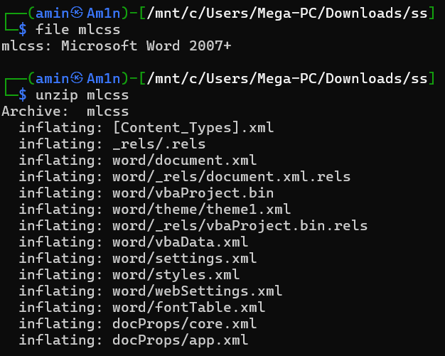

# Mail Attachment Malware Analysis Simulation

## Executive Summary

- **Sample file:** `mail sample.eml`
- **MD5:** `37b751b0e0e1c4831ab06c868f793849`
- **Source:** `Jozef_hamdani@mail.com` (IP `145.125.22.12`)
- **Victim:** `S1bouZ1toun@mail.com` (Host `10.10.20.1`)
- **Observed behavior:** Social-engineered email with Base64-encoded ZIP attachment that contains `vbaProject.bin`. The VBA macro deletes files with `.pdf` extension in the folder where it executes.

---

## Indicators of Compromise (IOCs)

- MD5: `37b751b0e0e1c4831ab06c868f793849` (`mail sample.eml`)
- Source email: `Jozef_hamdani@mail.com`
- Source IP: `145.125.22.12`
- Affected user: `S1bouZ1toun@mail.com`
- Affected host IP: `10.10.20.1`
- Extracted binary: `vbaProject.bin` (MD5: `a948f17ca04eee5240e0ca52a6d494b8`)

---

## Tactics, Techniques, and Procedures (TTPs)

- **Initial access:** Spear-phishing via mail attachment (human engineering).
- **Execution:** User opens macro-enabled document; macro executes and drops/executes `vbaProject.bin`.
- **Impact:** Macro deletes files with `.pdf` extension in the working directory.
- **Obfuscation:** Payload embedded in Base64-encoded ZIP inside the EML.

---

## Remediations

- Remove the malicious EML and extracted artifacts from mailboxes and file servers.
- Perform company-wide scan using the MD5 and other derived IOCs; quarantine matched systems.
- Isolate and reimage infected machines if persistence or further compromise is found.
- Restore deleted files from backups and from memory/image artifacts when possible.
- Harden mail gateway to block attachments with embedded Base64 ZIPs and suspicious OLE macros.

---
## Next Steps (priority-first)

1. **Immediate containment**: Isolate affected host `10.10.20.1` from the network and preserve volatile data (memory dump, running processes, open sockets).
2. **IOC enrichment & hunt**: Add MD5 `37b751b0e0e1c4831ab06c868f793849`, source IP `145.125.22.12`, sender `Jozef_hamdani@mail.com` and affected address `S1bouZ1toun@mail.com` into TI/Ticketing systems and perform a company-wide scan for matches.
3. **Forensic imaging**: Create a full forensic image of the infected machine and collect EML, ZIP, `vbaProject.bin` and any recovered deleted PDFs.
4. **Memory & timeline analysis**: Analyze RAM for in-memory artifacts and recover deleted files (use Volatility / Rekall); build a timeline of execution and file deletions.
5. **Sandbox detonation & dynamic analysis**: Execute the extracted payload in an isolated sandbox to capture behavior, network callbacks, and filesystem changes; capture PCAPs.
6. **Signature development**: Create YARA rules and detection signatures (antivirus, EDR, mail-gateway) for the VBA macro patterns and the extracted binary hash.
7. **Mail-gateway rules & parsing**: Update mail-filter rules to block the sender/IP and implement content-based detection for Base64-encoded ZIPs and embedded OLE macros.
8. **Recovery & remediation**: Restore deleted files from backups; rebuild or reimage compromised system if persistence is confirmed.
9. **User and org awareness**: Notify affected user(s), run a targeted phishing awareness campaign, and distribute indicators and remediation steps to the SOC and helpdesk.
10. **Post-incident reporting & lessons learned**: Produce a structured incident report with IOCs, detection gaps, attack timeline, and recommended hardening steps.

---
## Detailed Analysis

### Sample acquisition

An EML file was obtained from the affected user who reported PDFs being deleted in their working directory. The file was saved as `mail sample.eml` for analysis.


### Static analysis

- Opened the `.eml` in a text editor and inspected headers; the payload was contained in a Base64 section.
- Noticed the Base64 sequence begins with `UEsDBBQ` which corresponds to a ZIP file header.


### Decoding the payload

```
# saved base64 block to file 'mlcs'
echo "...MAAP1RAAAAAA==" > mlcs
base64 -d mlcs > mlcss
# examine output, found '2007.png' as an item name inside the archive
```
- Unzipping produced `vbaProject.bin` (reported MD5: `a948f17ca04eee5240e0ca52a6d494b8`).




### Extracting & analyzing macros

- Used `olevba` (oletools) to parse `vbaProject.bin` and extract the VBA source. Commands used:

```
pip install oletools
olevba vbaProject.bin
```

- The extracted VBA contained code that deletes files matching `*.pdf` in the current directory.


### Tools used

- Notepad / text editor (initial inspection)
- `base64` (decoding)
- `unzip` (archive extraction)
- `olevba` from `oletools` (VBA extraction and analysis)
- Hashing utility (`md5sum`) for file integrity

---

## Findings

1. The attack vector is a crafted email containing a Base64-encoded ZIP embedding an OLE/VBA macro (typical of commodity macro-malware campaigns).
2. The VBA payload specifically searches for and deletes `.pdf` files in the directory where the macro runs — high impact for document-heavy users.
3. The binary `vbaProject.bin` (MD5 `a948f17ca04eee5240e0ca52a6d494b8`) is the core extracted artifact; detection signatures should target both MD5 and macro patterns.

---

## More info I learnt

- **Binary (.bin):** Raw binary data that requires an associated program to interpret.
- **Executable (.exe):** Structured binary with metadata that OS loaders can execute directly.
- **VBA:** Scripting language used within Office documents; capable of filesystem operations and thus high-impact when abused.

---

## Notes for SOC handover

- Attach all artifacts to the ticket (EML, extracted binary, memory dump, PCAPs from sandbox).
- Provide YARA and mail-gateway signatures, plus recommended EDR/AV detections and a short user-facing notification template.

<!-- End of report -->

